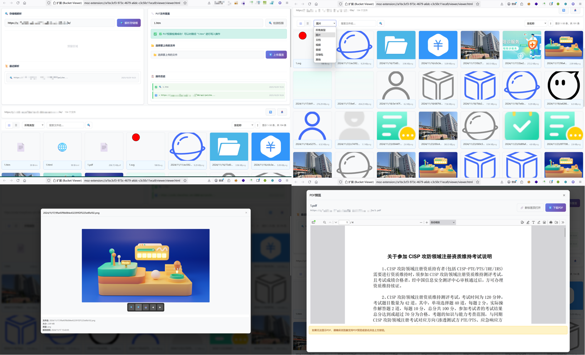

# Bucket Viewer - 存储桶遍历利用浏览器插件

一个全AI编写的浏览器插件，用于查看和管理对象存储桶中的文件。支持多种存储服务，提供优雅的界面来浏览、预览和下载文件。另支持存储桶PUT覆盖检测利用。

## ✨ 功能特性

### 📁 文件浏览
- **两种视图**：网格适合图片预览和快速浏览，列表显示详细文件信息，且支持大文件集的分页浏览;
- **在线预览**：批量图片在线预览、支持点击缩放查看，Office文件、PDF在线预览支持；

### 🎯 数据管理
- 按文件类型分类，按名称、大小、修改时间排序，实时搜索文件名；
- IndexedDB 本地存储、支持导出 CSV 格式文件列表，解析历史记录；


## 🚀 安装说明

### 方法一：开发者模式安装（推荐）

1. **下载插件文件**
   ```bash
   git clone https://github.com/iamHuFei/BucketViewer
   cd BucketViewer
   ```

2. **兼容浏览器**
   ```
   BucketViewer> .\switch_browser.bat
   Bucket Viewer Browser Switch
   1. Chrome
   2. Firefox
   Select browser (1 or 2): 2
         1 file(s) copied.
         1 file(s) copied.
   Switched to Firefox mode
   Press any key to continue . . .
   ```
3. **对应浏览器打开**

### 方法二：打包安装

Release选择对应浏览器插件下载安装

- 谷歌和Edge下载完成bucketviewer-chrome-1.0.0.zip后直接拖拽进行拓展界面安装

- 火狐浏览器正在审核中，后续支持，现可以通过下载bucketviewer-firefox-1.0.0.zip解压后在about:debugging#/runtime/this-firefox临时加载插件使用

## 📖 使用指南

### 基本使用

存储桶URL页面点击插件自动跳转解析网页




## 🔧 技术架构

### 核心技术
- **Manifest V3**: 最新的浏览器扩展标准
- **IndexedDB**: 客户端数据存储
- **原生 JavaScript**: 无外部依赖，性能优秀
- **CSS Grid/Flexbox**: 现代化响应式布局

### 文件结构
```
bucket-viewer-extension/
├── manifest.json                 # 通用配置文件（需要根据浏览器替换）
├── manifest_chrome.json         # Chrome/Edge 专用配置
├── manifest_firefox.json        # Firefox 专用配置
├── background.js                 # 通用后台脚本（需要根据浏览器替换）
├── background_chrome.js         # Chrome/Edge 专用后台脚本
├── background_firefox.js        # Firefox 专用后台脚本
├── content.js                    # 内容脚本（通用）
├── viewer/                       # 查看器界面
│   ├── viewer.html              # 查看器主页面
│   ├── viewer.css               # 查看器样式
│   ├── viewer.js                # 通用查看器脚本（需要根据浏览器替换）
│   └── viewer_firefox.js        # Firefox 专用查看器脚本
├── icons/                        # 图标文件
└── README.md                     # 项目说明文档
```

### 项目架构说明

- **多浏览器支持**: 项目提供针对不同浏览器的专门配置和脚本
- **Manifest V2/V3 兼容**: Chrome 版本支持最新的 Manifest V3 标准
- **模块化设计**: 核心功能模块化，便于维护和扩展
- **响应式界面**: 使用现代 CSS 网格和弹性布局技术


## 🙏 致谢

- 基于 [sourcexu7/ossx](https://github.com/sourcexu7/ossx) 项目的 XML 解析逻辑；
- 基于 [jdr2021/OSSFileBrowse](https://github.com/jdr2021/OSSFileBrowse) 项目延申，KKfileview在线预览无法解决私有存储桶问题（图片PDF在线预览本地支持）
- 全程使用ClaudeCode对接ClaudeAPI进行开发，感谢AI，感谢所有开源社区的支持和贡献者！