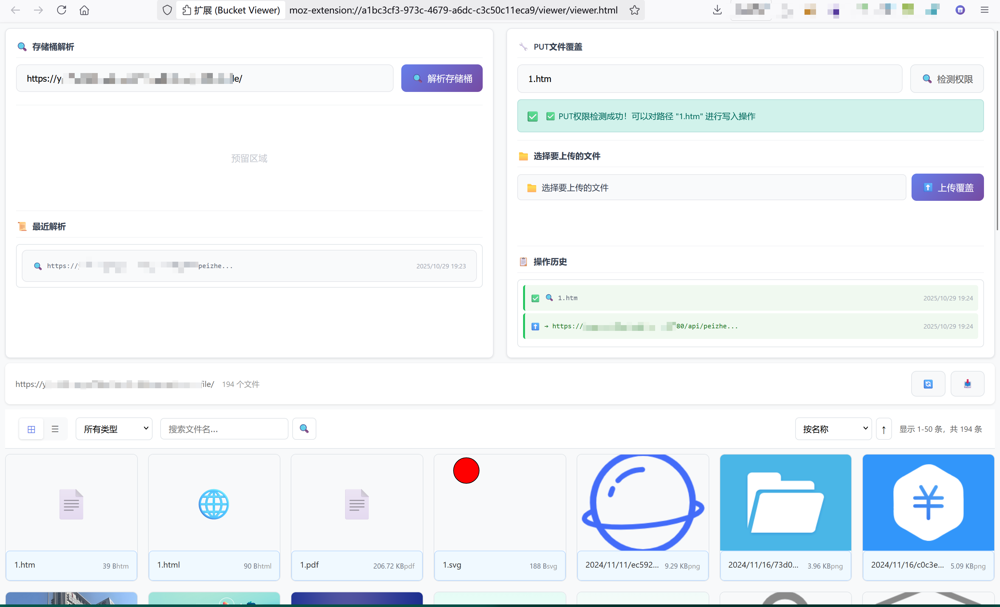

# Bucket Viewer - 存储桶遍历利用浏览器插件

一个全AI编写的浏览器插件，用于查看和管理存储桶遍历漏洞泄露文件；支持多种存储服务，提供优雅的界面来浏览、预览和下载文件；另支持存储桶PUT覆盖检测利用。

## ✨ 功能特性

### 📁 文件浏览
- **两种视图**：网格适合图片预览和快速浏览，列表显示详细文件信息，且支持大文件集的分页浏览（防浏览器卡死设置最大10000条）;
- **在线预览**：批量图片在线预览、支持点击缩放查看，Office文件、PDF在线预览支持；

### 🎯 数据管理
- 按文件类型分类，按名称、大小、修改时间排序，实时搜索文件名；
- IndexedDB 本地存储、支持导出 CSV 格式文件列表，解析历史记录；


## 🚀 安装说明

### 方法一：自行构建安装

1. **下载插件文件**
   ```bash
   git clone https://github.com/iamHuFei/BucketViewer
   cd BucketViewer
   ```

2. **自行构建**

   PowerShell运行以下命令在当前文件夹生成build/目录
   ```PowerShell
   Firefox: .\build.ps1 -Browser firefox
   Chrome: .\build.ps1 -Browser chrome
   ```

3. 打开浏览器扩展管理页面：
   - **Chrome**: `chrome://extensions/`
   - **Firefox**: `about:addons`

4. 启用"开发者模式" > 点击"加载已解压的扩展程序"

5. 选择对应的构建目录：
   - **Chrome**: `build/chrome/`
   - **Firefox**: `build/firefox/`

### 方法二：打包安装（推荐）

Release选择对应浏览器插件下载安装

- 谷歌和Edge下载完成bucketviewer-chrome-1.0.0.zip后直接拖拽进行拓展界面安装

- 火狐浏览器正在审核中，后续支持，现可以通过下载bucketviewer-firefox-1.0.0.zip解压后在about:debugging#/runtime/this-firefox临时加载插件使用

## 📖 使用指南

### 基本使用

存储桶URL页面点击插件自动跳转解析网页




## 🔧 技术架构

### 核心技术
- **Manifest V3**: 最新的浏览器扩展标准
- **IndexedDB**: 客户端数据存储
- **原生 JavaScript**: 无外部依赖，性能优秀
- **CSS Grid/Flexbox**: 现代化响应式布局

### 文件结构
```
BucketViewer/
├── manifest.json          (Firefox MV2)
├── manifest_chrome.json   (Chrome MV3)
├── background.js          后台脚本
├── content.js             内容脚本
├── viewer/
│   ├── viewer.js          前端逻辑
│   ├── viewer.html        界面模板
│   └── viewer.css         样式表
└── build_unified.bat      (构建脚本)
```

### 项目架构说明

- **多浏览器支持**: 项目提供针对不同浏览器的专门配置和脚本
- **Manifest V2/V3 兼容**: Chrome 版本支持最新的 Manifest V3 标准
- **模块化设计**: 核心功能模块化，便于维护和扩展
- **响应式界面**: 使用现代 CSS 网格和弹性布局技术


## 🙏 致谢

- 基于 [sourcexu7/ossx](https://github.com/sourcexu7/ossx) 项目的 XML 解析逻辑；
- 基于 [jdr2021/OSSFileBrowse](https://github.com/jdr2021/OSSFileBrowse) 项目延申，KKfileview在线预览无法解决私有存储桶问题（图片PDF在线预览本地支持）
- 全程使用ClaudeCode对接ClaudeAPI进行开发，感谢AI，感谢所有开源社区的支持和贡献者！